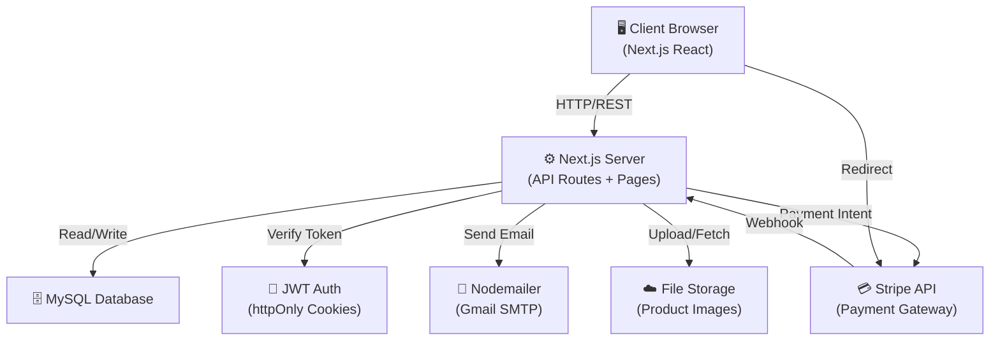
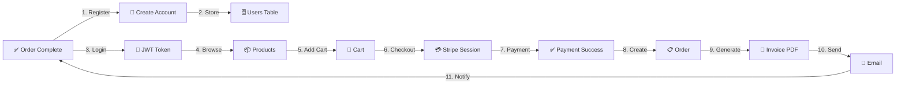
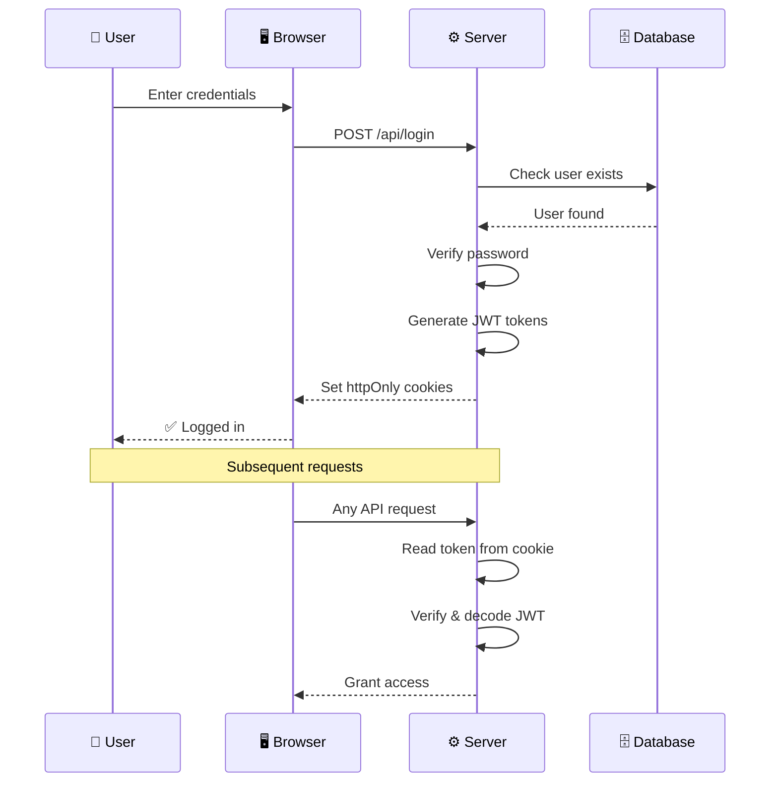
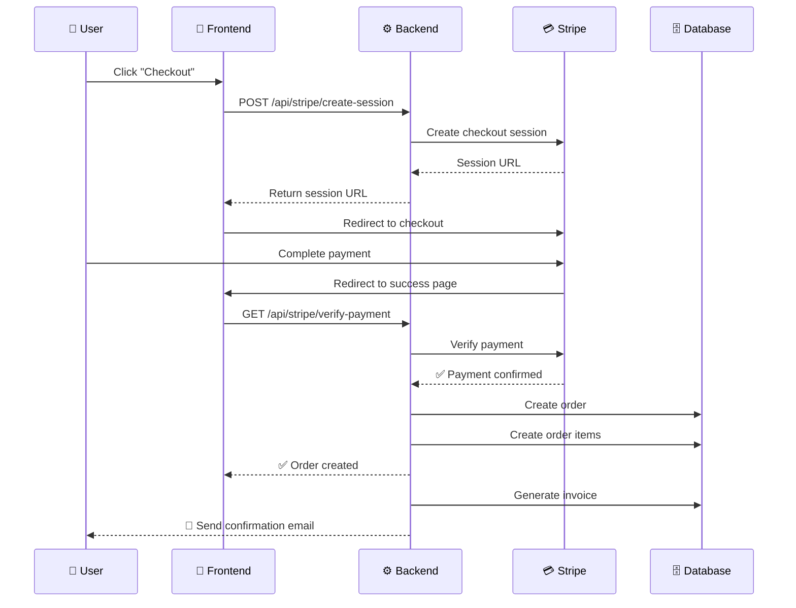
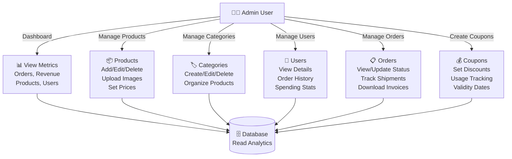

# 🚀 RocketDrop - E-Commerce Platform

A modern, full-stack e-commerce platform built with Next.js 15, featuring secure authentication, Stripe payment integration, advanced admin panel, and comprehensive order management.

> **Current Version:** 1.2.0 | **Status:** Production Ready (95%) | **Last Updated:** January 15, 2026

---

## **🏗️ System Architecture**

### **High-Level Architecture**


### **Data Flow: User Registration → Purchase → Invoice**


---

## **📋 Features**

### **✅ User-Side Features**

| Feature | Description | Status |
|---------|-------------|--------|
| 🔐 **JWT Authentication** | Secure login/register with access & refresh tokens | ✅ Complete |
| 👥 **User Dashboard** | Profile management and order history | ✅ Complete |
| 🛒 **Shopping Cart** | Persistent cart with guest/user merge | ✅ Complete |
| 📦 **Product Browsing** | Browse by categories with advanced filters | ✅ Complete |
| ⭐ **Product Reviews** | Leave and view customer reviews | ✅ Complete |
| 💳 **Stripe Payment** | Secure card and digital wallet payments | ✅ Complete |
| 📋 **Order Management** | Complete order tracking and history | ✅ Complete |
| ❌ **Order Cancellation** | Cancel orders with automatic Stripe refunds | ✅ Complete |
| 🧾 **Invoice Download** | Download professional PDF invoices | ✅ Complete |
| 📧 **Email Notifications** | Order confirmations, cancellations, invoices | ✅ Complete |
| ❤️ **Wishlist** | Save favorite products for later | ✅ Complete |
| 🔑 **Password Reset** | Secure token-based password recovery | ✅ Complete |

### **✅ Admin-Side Features**

| Feature | Description | Status |
|---------|-------------|--------|
| 📊 **Admin Dashboard** | Overview of orders, revenue, products | ✅ Complete |
| 📦 **Product Management** | CRUD operations with image uploads | ✅ Complete |
| 🏷️ **Category Management** | Create, edit, delete product categories | ✅ Complete |
| 👥 **User Management** | View all users with order history and statistics | ✅ Complete |
| 📋 **Order Management** | View and manage all orders with status updates | ✅ Complete |
| 💰 **Coupon Management** | Create discount codes with usage tracking | ✅ Complete |
| 🔐 **Role-Based Access** | Admin-only protected routes | ✅ Complete |

### **✅ System Features**

| Feature | Description | Status |
|---------|-------------|--------|
| 🔐 **Security** | JWT authentication, password hashing, middleware protection | ✅ Complete |
| 📧 **Email System** | Order confirmations, password resets, invoices, cancellations | ✅ Complete |
| 🎨 **Modern UI** | Responsive design with Tailwind CSS & Framer Motion | ✅ Complete |
| 📱 **Mobile Responsive** | Fully responsive on all devices | ✅ Complete |
| ⚡ **Performance** | Optimized queries, caching with SWR | ✅ Complete |
| 🧾 **PDF Invoices** | Generate and email professional invoices | ✅ Complete |
| 📊 **Admin Analytics** | Dashboard with key metrics and statistics | ✅ Complete |

---

## **🚀 Quick Start**

### **1. Clone & Install**

```bash
cd rocketdrop
npm install --legacy-peer-deps
```

### **2. Database Setup**

```bash
# Create database
mysql -u root -p
CREATE DATABASE rocketdrop;

# Run migrations for all tables (from database folder or docs)
# Ensure these tables exist: users, products, categories, orders, order_items, coupons, reviews, wishlists

# Add invoice columns to orders table (if not already present)
ALTER TABLE orders ADD COLUMN cancelled_at TIMESTAMP NULL;
ALTER TABLE orders ADD COLUMN cancellation_reason VARCHAR(500);
```

### **3. Environment Configuration**

Copy `.env.example` to `.env.local` and fill in your values:

```bash
cp .env.example .env.local
```

### **4. Run Development Server**

```bash
npm run dev
```

Open [http://localhost:3000](http://localhost:3000)

---

## **⚙️ Environment Variables - ACTION REQUIRED**

### **🔴 MUST CONFIGURE (App won't work without these):**

#### **Database Configuration**
```env
DB_HOST=localhost
DB_PORT=3306
DB_USER=root
DB_PASSWORD=your_mysql_password
DB_NAME=rocketdrop
```

#### **JWT Secret** (Generate a secure key)
```bash
# Run this command to generate:
node -e "console.log(require('crypto').randomBytes(32).toString('hex'))"
```
```env
JWT_SECRET=your_generated_secret_here
```

---

### **🟡 REQUIRED FOR PAYMENTS (Stripe):**

1. **Sign up:** https://dashboard.stripe.com/register
2. **Get Test Keys:** Developers → API Keys
3. **Add to .env.local:**

```env
NEXT_PUBLIC_STRIPE_PUBLISHABLE_KEY=pk_test_XXXXXXXXXXXXX
STRIPE_SECRET_KEY=sk_test_YYYYYYYYYYYYYYYYYY
NEXT_PUBLIC_BASE_URL=http://localhost:3000
```

**📖 Detailed Guide:** See [docs/RAZORPAY_SETUP_GUIDE.md](docs/RAZORPAY_SETUP_GUIDE.md) (renamed for reference)

---

### **🟡 REQUIRED FOR EMAILS:**

1. **Enable 2FA:** https://myaccount.google.com/security
2. **Generate App Password:** https://myaccount.google.com/apppasswords
3. **Add to .env.local:**

```env
EMAIL_HOST=smtp.gmail.com
EMAIL_PORT=587
EMAIL_USER=your_email@gmail.com
EMAIL_PASSWORD=your_16_char_app_password
EMAIL_FROM=RocketDrop <noreply@rocketdrop.com>
ADMIN_EMAIL=admin_email@gmail.com
```

---

### **🟢 OPTIONAL (Already Set):**

```env
NEXT_PUBLIC_API_URL=http://localhost:3000
NODE_ENV=development
```

---

## **� Authentication Flow**



---

## **💳 Payment & Order Flow**



---
## **👨‍💼 Admin Operations Flow**



---

## **📊 Data Model Relationships**

```mermaid
erDiagram
    USERS ||--o{ ORDERS : places
    USERS ||--o{ REVIEWS : writes
    USERS ||--o{ WISHLISTS : creates
    PRODUCTS ||--o{ ORDERS : "ordered in"
    PRODUCTS ||--o{ REVIEWS : "reviewed in"
    PRODUCTS ||--o{ WISHLISTS : "added to"
    PRODUCTS }o--|| CATEGORIES : "belongs to"
    ORDERS ||--|{ ORDER_ITEMS : contains
    ORDERS ||--o{ COUPONS : applies
    
    USERS : int id
    USERS : string username
    USERS : string email
    USERS : string role
    
    PRODUCTS : int id
    PRODUCTS : string name
    PRODUCTS : decimal price
    PRODUCTS : int category_id
    
    CATEGORIES : int id
    CATEGORIES : string name
    CATEGORIES : string slug
    
    ORDERS : int order_id
    ORDERS : int user_id
    ORDERS : decimal total_amount
    ORDERS : string order_status
    
    ORDER_ITEMS : int item_id
    ORDER_ITEMS : int order_id
    ORDER_ITEMS : int product_id
    
    COUPONS : int id
    COUPONS : string code
    COUPONS : string discount_type
    
    REVIEWS : int id
    REVIEWS : int product_id
    REVIEWS : int user_id
    
    WISHLISTS : int id
    WISHLISTS : int user_id
    WISHLISTS : int product_id
```

---
## **�📁 Project Structure**

```
rocketdrop/
├── src/
│   ├── app/                           # Next.js App Router pages
│   │   ├── api/
│   │   │   ├── auth/                 # Authentication endpoints
│   │   │   ├── stripe/               # Payment endpoints
│   │   │   ├── cart/                 # Cart management
│   │   │   ├── categories/           # Category endpoints
│   │   │   ├── products/             # Product endpoints
│   │   │   ├── reviews/              # Review endpoints
│   │   │   ├── wishlists/            # Wishlist endpoints
│   │   │   ├── coupons/              # Coupon validation
│   │   │   ├── myorders/             # User orders
│   │   │   ├── orders/
│   │   │   │   ├── [id]/invoice/    # Invoice generation ✨ NEW
│   │   │   │   └── cancel/           # Order cancellation
│   │   │   └── admin/
│   │   │       ├── categories/       # Category CRUD ✨ NEW
│   │   │       ├── coupons/          # Coupon CRUD ✨ NEW
│   │   │       ├── products/         # Product management
│   │   │       ├── orders/           # Order management
│   │   │       └── users/            # User management ✨ NEW
│   │   ├── pages/
│   │   │   ├── login/
│   │   │   ├── register/
│   │   │   ├── checkout/
│   │   │   ├── myorders/
│   │   │   ├── admin/
│   │   │   │   ├── categories/       # Category management UI ✨ NEW
│   │   │   │   ├── coupons/          # Coupon management UI ✨ NEW
│   │   │   │   ├── users/            # User management UI ✨ NEW
│   │   │   │   ├── orders/
│   │   │   │   ├── products/
│   │   │   │   └── admin-dashboard/
│   │   └── ...
│   ├── components/                   # Reusable React components
│   ├── contexts/                     # React Context (Auth, Cart)
│   ├── hooks/                        # Custom React hooks
│   ├── lib/
│   │   ├── db.js                    # MySQL connection
│   │   ├── jwt.js                   # JWT utilities
│   │   ├── email.js                 # Email sending with invoice support ✨
│   │   ├── invoice.js               # PDF invoice generation ✨ NEW
│   │   ├── api-middleware.js        # Auth middleware
│   │   └── ...
│   └── utils/                        # Helper functions
├── public/                           # Static assets
├── database/                         # SQL migration scripts
├── docs/                             # Technical documentation
│   ├── JWT_IMPLEMENTATION_SUMMARY.md
│   └── RAZORPAY_SETUP_GUIDE.md
├── package.json                      # Dependencies (includes pdfkit ✨)
└── README.md                         # This file
```

---

## **🆕 New Features (Latest Updates)**

### **Phase 3: Category Management** ✨
- ✅ Admin can create, edit, delete product categories
- ✅ Searchable category list with filtering
- ✅ Category images and metadata
- ✅ Auto-slug generation from category name
- 📍 Location: `/admin/categories`

### **Phase 3: User Management** ✨
- ✅ View all users with pagination and search
- ✅ User statistics (total orders, spending, etc.)
- ✅ View user order history from user details
- ✅ Role-based filtering (User/Admin)
- 📍 Location: `/admin/users`

### **Phase 3: Coupon Management** ✨
- ✅ Create, edit, delete discount coupons
- ✅ Support for percentage and fixed discounts
- ✅ Usage tracking (max uses, current uses)
- ✅ Validity date range management
- ✅ Status filtering (Active, Inactive, Expired)
- 📍 Location: `/admin/coupons`

### **Phase 4: Invoice Generation** ✨✨ CRITICAL
- ✅ Professional PDF invoice generation
- ✅ Download invoices from order history (user & admin)
- ✅ Complete order details with itemization
- ✅ Email invoices automatically with PDF attachment
- ✅ Automatic calculations (subtotal, discount, total)
- 📍 Download button on all order pages
- 📍 API: `/api/orders/[id]/invoice`

### **Order Cancellation with Refunds** ✨
- ✅ Users can cancel pending/processing orders
- ✅ Automatic Stripe refund processing
- ✅ Cancellation reason tracking
- ✅ Email notifications to user and admin
- ✅ Admin visibility of cancelled orders
- 📍 Location: Order history cards

---

## **🧪 Testing Checklist**

### **1. User Registration & Login**
- [ ] Register a new user
- [ ] Auto-login after registration
- [ ] Toast notification appears
- [ ] Redirect to user dashboard

### **2. Password Reset**
- [ ] Go to `/forgot-password`
- [ ] Enter email
- [ ] Check inbox for reset link
- [ ] Click link and set new password
- [ ] Login with new password

### **3. Payment Flow (Stripe)**
- [ ] Add products to cart
- [ ] Go to checkout
- [ ] Verify coupon discount works
- [ ] Complete Stripe payment with test card: `4242 4242 4242 4242`
- [ ] Payment succeeds and order created
- [ ] Email confirmation received
- [ ] Download invoice from order history

### **4. Order Cancellation**
- [ ] Create an order
- [ ] Click "Cancel Order" button
- [ ] Submit cancellation reason
- [ ] Verify order status changes to "cancelled"
- [ ] Check email for cancellation notification
- [ ] Verify Stripe refund processed

### **5. Admin Panel**
- [ ] Login as admin (role = 'admin')
- [ ] **Dashboard:** View total revenue, orders, users
- [ ] **Categories:** Create, edit, delete categories
- [ ] **Products:** Manage products with images
- [ ] **Coupons:** Create discount codes with rules
- [ ] **Orders:** View all orders, update status, download invoices
- [ ] **Users:** Search users, view order history and spending stats

---

## **📚 Documentation**

- **JWT Authentication:** [docs/JWT_IMPLEMENTATION_SUMMARY.md](docs/JWT_IMPLEMENTATION_SUMMARY.md)
- **Stripe Setup:** [docs/RAZORPAY_SETUP_GUIDE.md](docs/RAZORPAY_SETUP_GUIDE.md)

---

## **🛠 Tech Stack**

- **Frontend:** Next.js 15, React 19, Tailwind CSS, Framer Motion
- **Backend:** Node.js, Next.js API Routes
- **Database:** MySQL
- **Payment:** Stripe
- **Email:** Nodemailer (Gmail)
- **PDF Generation:** pdfkit ✨
- **Authentication:** JWT (JSON Web Tokens)
- **UI Components:** Lucide Icons, Custom components

---

## **📦 Key Dependencies**

```json
{
  "next": "15.5.5",
  "react": "19.1.0",
  "stripe": "^15.0.0",
  "nodemailer": "^6.9.0",
  "pdfkit": "^0.14.0",
  "mysql2": "^3.7.0",
  "jsonwebtoken": "^9.1.0",
  "bcrypt": "^5.1.1",
  "framer-motion": "^11.0.3",
  "react-hot-toast": "^2.4.1",
  "tailwindcss": "^3.4.0"
}
```

---

## **🚨 Known Issues & Limitations**

- Stock management system not yet implemented
- Email templates could be more customizable
- Admin audit logging not implemented
- Review moderation system pending

---

## **🔄 Roadmap**

- [ ] **Stock Management** - Inventory tracking and low-stock alerts
- [ ] **Order Status Emails** - Automated shipping/delivery notifications  
- [ ] **Sales Analytics** - Advanced reporting and insights
- [ ] **Review Moderation** - Approve/reject customer reviews
- [ ] **Newsletter System** - Email campaigns and subscriber management
- [ ] **Multi-language Support** - i18n implementation
- [ ] **Mobile App** - React Native version

---

## **📞 Support**

For issues or questions:
1. Check the docs folder
2. Review the code comments
3. Check environment variables are set correctly

---

## **📄 License**

This project is proprietary software. All rights reserved.

---

**Last Updated:** January 15, 2026  
**Version:** 1.2.0 (With Invoice & Admin Features)

---

## **🚀 Quick Start**

### **1. Clone & Install**

```bash
cd rocketdrop
npm install
```

### **2. Database Setup**

```bash
# Create database
mysql -u root -p
CREATE DATABASE rocketdrop;

# Run migrations (from database folder)
mysql -u root -p rocketdrop < database/create_password_reset_table.sql

# Add Stripe columns to orders table
ALTER TABLE orders ADD COLUMN stripe_session_id VARCHAR(255);
ALTER TABLE orders ADD COLUMN stripe_payment_id VARCHAR(255);
```

### **3. Environment Configuration**

Copy `.env.example` to `.env.local` and fill in your values:

```bash
cp .env.example .env.local
```

### **4. Run Development Server**

```bash
npm run dev
```

Open [http://localhost:3000](http://localhost:3000)

---

## **⚙️ Environment Variables - ACTION REQUIRED**

### **🔴 MUST CONFIGURE (App won't work without these):**

#### **Database Configuration**
```env
DB_HOST=localhost
DB_PORT=3306
DB_USER=root
DB_PASSWORD=your_mysql_password
DB_NAME=rocketdrop
```

#### **JWT Secret** (Generate a secure key)
```bash
# Run this command to generate:
node -e "console.log(require('crypto').randomBytes(32).toString('hex'))"
```
```env
JWT_SECRET=your_generated_secret_here
```

---

### **🟡 REQUIRED FOR PAYMENTS (Stripe):**

1. **Sign up:** https://dashboard.stripe.com/register
2. **Get Test Keys:** Developers → API Keys
3. **Add to .env.local:**

```env
NEXT_PUBLIC_STRIPE_PUBLISHABLE_KEY=pk_test_XXXXXXXXXXXXX
STRIPE_SECRET_KEY=sk_test_YYYYYYYYYYYYYYYYYY
STRIPE_WEBHOOK_SECRET=whsec_ZZZZZZZZZZZZZZZZ
```

**📖 Detailed Guide:** See [STRIPE_SETUP_GUIDE.md](STRIPE_SETUP_GUIDE.md)

---

### **🟡 REQUIRED FOR EMAILS (Gmail):**

1. **Enable 2FA:** https://myaccount.google.com/security
2. **Generate App Password:** https://myaccount.google.com/apppasswords
3. **Add to .env.local:**

```env
EMAIL_HOST=smtp.gmail.com
EMAIL_PORT=587
EMAIL_USER=your_email@gmail.com
EMAIL_PASSWORD=your_16_char_app_password
EMAIL_FROM=RocketDrop <noreply@rocketdrop.com>
```

---

### **🟢 OPTIONAL (Already Set):**

```env
NEXT_PUBLIC_API_URL=http://localhost:3000
NODE_ENV=development
```

---

## **📁 Project Structure**

```
rocketdrop/
├── src/
│   ├── app/                    # Next.js App Router pages
│   │   ├── api/               # API routes
│   │   │   ├── auth/          # Authentication endpoints
│   │   │   ├── stripe/        # Payment endpoints
│   │   │   ├── cart/          # Cart management
│   │   │   ├── orders/        # Order management
│   │   │   └── admin/         # Admin APIs
│   │   ├── login/             # Login page
│   │   ├── register/          # Registration page
│   │   ├── forgot-password/   # Password reset request
│   │   ├── reset-password/    # Password reset form
│   │   ├── checkout/          # Checkout page
│   │   ├── user-dashboard/    # User dashboard
│   │   └── admin/             # Admin panel
│   ├── components/            # Reusable React components
│   ├── contexts/              # React Context (Auth, Cart)
│   ├── hooks/                 # Custom React hooks
│   ├── lib/                   # Utilities
│   │   ├── db.js             # MySQL connection
│   │   ├── jwt.js            # JWT utilities
│   │   ├── email.js          # Email sending
│   │   └── api-middleware.js # Auth middleware
│   └── utils/                 # Helper functions
├── public/                    # Static assets
├── database/                  # SQL migration scripts
│   └── create_password_reset_table.sql
├── docs/                      # Technical documentation
│   └── JWT_IMPLEMENTATION_SUMMARY.md
├── .env.local                 # Your environment variables (GITIGNORED)
├── .env.example               # Environment template
├── package.json               # Dependencies
└── README.md                  # This file
```

---

## **🧪 Testing Checklist**

### **1. User Registration & Login**
- [ ] Register a new user
- [ ] Auto-login after registration
- [ ] Toast notification appears (500ms)
- [ ] Redirect to user dashboard

### **2. Password Reset**
- [ ] Go to `/forgot-password`
- [ ] Enter email
- [ ] Check inbox for reset link
- [ ] Click link and set new password
- [ ] Login with new password

### **3. Payment Flow (Stripe)**
- [ ] Add products to cart
- [ ] Go to checkout
- [ ] Select "Card Payment (Stripe)"
- [ ] Use test card: `4242 4242 4242 4242`
- [ ] Payment succeeds
- [ ] Email confirmation received
- [ ] Order shows in "My Orders"

### **4. Admin Panel**
- [ ] Login as admin
- [ ] Access `/admin/admin-dashboard`
- [ ] View orders
- [ ] Manage productsdocs/JWT_IMPLEMENTATION_SUMMARY.md](docs/JWT_IMPLEMENTATION_SUMMARY.md)
- **Payment Setup:** [docs/RAZORPAY_SETUP_GUIDE.md](docs/
---

## **📚 Additional Documentation**

- **JWT Implementation:** [docs/JWT_IMPLEMENTATION_SUMMARY.md](docs/JWT_IMPLEMENTATION_SUMMARY.md)
- **Stripe Payment Setup:** [STRIPE_SETUP_GUIDE.md](STRIPE_SETUP_GUIDE.md)
- **Stripe Migration Summary:** [STRIPE_MIGRATION_SUMMARY.md](STRIPE_MIGRATION_SUMMARY.md)

---

## **🔧 Common Issues & Solutions**

### **"Failed to fetch" error**
✅ **Fixed:** All fetch calls now include `credentials: 'include'` for JWT cookies

### **Email not sending**
- Verify Gmail app password (16 characters, no spaces)
- Check 2FA is enabled
- Look in spam folder

### **Stripe checkout not working**
- Ensure `NEXT_PUBLIC_STRIPE_PUBLISHABLE_KEY` is set
- Check browser console for errors
- Verify using test mode keys (pk_test_...)
- Check Stripe Dashboard for webhook events

### **Database connection failed**
- Verify MySQL is running
- Check credentials in `.env.local`
- Ensure database `rocketdrop` exists

---

## **📦 Tech Stack**

- **Framework:** Next.js 15.5.5 (App Router)
- **UI:** React 19, Tailwind CSS, Framer Motion
- **Database:** MySQL2 with connection pooling
- **Authentication:** JWT (jose library)
- **Payments:** Stripe SDK
- **Email:** Nodemailer (Gmail SMTP)
- **Security:** bcrypt, HTTP-only cookies, CSRF protection

---

## **🚀 Production Deployment**

### **Before Going Live:**

1. **Switch to Stripe Live Keys** (pk_live_... and sk_live_...)
2. **Configure Stripe Webhook** in Dashboard with production URL
3. **Update environment variables** in hosting platform
4. **Enable HTTPS** (required for Stripe)
5. **Configure email service** for production (SendGrid/AWS SES recommended)
6. **Update CORS settings** if needed
7. **Run production build:** `npm run build`

### **Hosting Options:**
- **Vercel** (Recommended - automatic deployments)
- **Railway** (Database + App hosting)
- **DigitalOcean/AWS** (Full control)

See [docs/DEPLOYMENT.md](docs/DEPLOYMENT.md) for detailed instructions.

---

## **📚 Documentation**

Complete documentation is available in the [docs/](docs/) folder:

- **[ARCHITECTURE.md](docs/ARCHITECTURE.md)** - System design, DFDs, data flows (NEW ⭐)
- **[FEATURES.md](docs/FEATURES.md)** - Complete feature inventory
- **[API_ROUTES.md](docs/API_ROUTES.md)** - All API endpoints reference
- **[DEPLOYMENT.md](docs/DEPLOYMENT.md)** - Production deployment guide
- **[CHANGELOG.md](docs/CHANGELOG.md)** - Version history
- **[QUICK_REFERENCE.md](docs/QUICK_REFERENCE.md)** - Developer quick guide
- **[JWT_IMPLEMENTATION_SUMMARY.md](docs/JWT_IMPLEMENTATION_SUMMARY.md)** - Auth implementation

---

## **📦 Tech Stack**

- **Framework:** Next.js 15.5.5 (App Router)
- **UI:** React 19, Tailwind CSS, Framer Motion
- **Database:** MySQL2 with connection pooling
- **Authentication:** JWT (jose library)
- **Payments:** Stripe SDK
- **Email:** Nodemailer (Gmail SMTP)
- **PDF Generation:** pdfkit 0.14.0
- **Security:** bcrypt, HTTP-only cookies, CSRF protection

---

## **📊 System Status**

| Component | Status | Notes |
|-----------|--------|-------|
| Core Features | ✅ Complete | All user-side features working |
| Admin Panel | ✅ Complete | 95% - Stock management pending |
| Authentication | ✅ Complete | JWT + Password reset implemented |
| Payments | ✅ Complete | Stripe integration with refunds |
| Email System | ✅ Complete | Invoices, confirmations, notifications |
| Invoice System | ✅ Complete | PDF generation and download |
| Documentation | ✅ Complete | Comprehensive architecture & guides |

---

## **📝 License**

Private project - All rights reserved

---

## **👨‍💻 Support**

For issues or questions, contact: support@rocketdrop.com

---

**Built with ❤️ using Next.js**

## Deploy on Vercel

The easiest way to deploy your Next.js app is to use the [Vercel Platform](https://vercel.com/new?utm_medium=default-template&filter=next.js&utm_source=create-next-app&utm_campaign=create-next-app-readme) from the creators of Next.js.

Check out our [Next.js deployment documentation](https://nextjs.org/docs/app/building-your-application/deploying) for more details.

