# 🏗️ RocketDrop - System Architecture

Complete system architecture, data flows, and component interactions for the RocketDrop e-commerce platform.

---

## **📊 High-Level System Architecture**


---

## **🔄 Request-Response Cycle**

```mermaid
sequenceDiagram
    actor User
    participant Browser as 🖥️ Browser
    participant NextJS as ⚙️ Next.js Server
    participant Middleware as 🔐 Auth Middleware
    participant Database as 🗄️ MySQL
    participant Service as 🔧 Service Layer

    User->>Browser: User Action
    Browser->>NextJS: HTTP Request
    
    alt Protected Route
        NextJS->>Middleware: Check Token
        Middleware->>Middleware: Parse JWT from Cookie
        Middleware->>Middleware: Verify Signature
        alt Token Valid
            Middleware-->>NextJS: ✅ Token Valid
        else Token Invalid
            Middleware-->>NextJS: ❌ Unauthorized
            NextJS-->>Browser: 401 Unauthorized
            Browser-->>User: Redirect to Login
        end
    end
    
    alt Database Operation Needed
        NextJS->>Service: Process Business Logic
        Service->>Database: Query/Update/Delete
        Database-->>Service: Result
        Service-->>NextJS: Processed Data
    else External Service Needed
        NextJS->>Service: Call Service
        Service->>Service: External API Call
        Service-->>NextJS: Response
    end
    
    NextJS-->>Browser: JSON Response
    Browser->>Browser: Update State
    Browser-->>User: Render UI
```



---

## **🔐 Authentication & Authorization Architecture**

```mermaid
graph TB
    subgraph Auth["Authentication System"]
        Login["1️⃣ Login API<br/>/api/login"]
        Hash["2️⃣ Verify Password<br/>(bcrypt)"]
        JWT["3️⃣ Generate JWT Tokens<br/>(Access + Refresh)"]
        Cookie["4️⃣ Set httpOnly Cookie<br/>(Secure)"]
    end
    
    subgraph Verify["Verification System"]
        Request["API Request<br/>with Cookie"]
        Extract["Extract Token<br/>from Cookie"]
        Decode["Decode JWT<br/>(verify signature)"]
        Check["Check Role<br/>(user/admin)"]
    end
    
    subgraph Refresh["Token Refresh"]
        ExpireToken["Access Token Expired"]
        RefreshAPI["/api/auth/refresh"]
        NewToken["Generate New<br/>Access Token"]
        SetNew["Update Cookie<br/>with New Token"]
    end
    
    User["👤 User Credentials"]
    DB[("🗄️ Database<br/>User Records")]
    
    User -->|1️⃣ POST /api/login| Login
    Login -->|Fetch User| DB
    Login -->|2️⃣ Hash Check| Hash
    Hash -->|3️⃣ Generate| JWT
    JWT -->|4️⃣ Set Cookie| Cookie
    Cookie -->|✅ Login Success| Client["🖥️ Client"]
    
    Client -->|Request| Request
    Request -->|Extract| Extract
    Extract -->|Decode| Decode
    Decode -->|Check| Check
    Check -->|✅ Valid| Allow["✅ Allow Access"]
    Check -->|❌ Invalid| Deny["❌ Deny Access"]
    
    Allow -.->|Continue| DB
    ExpireToken -->|Trigger| RefreshAPI
    RefreshAPI -->|Validate Refresh| DB
    RefreshAPI -->|Generate| NewToken
    NewToken -->|Set| SetNew
    SetNew -->|Continue Session| Client
```



---

## **💳 Payment Processing Flow**


---

## **👨‍💼 Admin Panel Operations**

```mermaid
graph TB
    Admin["👨‍💼 Admin"]
    Dashboard["Admin Dashboard<br/>/admin/dashboard"]
    
    Dashboard -->|View| Stats["📊 Statistics<br/>Total Orders<br/>Total Revenue<br/>New Users"]
    
    subgraph ProductMgmt["📦 Product Management"]
        PList["View Products<br/>/admin/products"]
        PAdd["Add Product<br/>/admin/products/add"]
        PEdit["Edit Product<br/>/admin/products/[id]/edit"]
        PDel["Delete Product"]
    end
    
    subgraph CategoryMgmt["🏷️ Category Management"]
        CList["View Categories<br/>/admin/categories"]
        CAdd["Add Category"]
        CEdit["Edit Category"]
        CDel["Delete Category"]
    end
    
    subgraph UserMgmt["👥 User Management"]
        UList["View Users<br/>/admin/users"]
        UDetail["User Details<br/>Order History<br/>Spending Stats"]
    end
    
    subgraph OrderMgmt["📋 Order Management"]
        OList["View Orders<br/>/admin/orders"]
        OStatus["Update Status"]
        OCancel["View Cancellations"]
        OInvoice["Download Invoice"]
    end
    
    subgraph CouponMgmt["💰 Coupon Management"]
        CpList["View Coupons<br/>/admin/coupons"]
        CpAdd["Add Coupon"]
        CpEdit["Edit Coupon"]
        CpDel["Delete Coupon"]
    end
    
    Database["🗄️ Database<br/>Read/Write"]
    
    Admin -->|Access| Dashboard
    
    Dashboard -->|Manage| ProductMgmt
    Dashboard -->|Manage| CategoryMgmt
    Dashboard -->|Manage| UserMgmt
    Dashboard -->|Manage| OrderMgmt
    Dashboard -->|Manage| CouponMgmt
    
    PList -->|CRUD| Database
    PAdd -->|Insert| Database
    PEdit -->|Update| Database
    PDel -->|Delete| Database
    
    CList -->|CRUD| Database
    CAdd -->|Insert| Database
    CEdit -->|Update| Database
    CDel -->|Delete| Database
    
    UList -->|Read| Database
    UDetail -->|Join with Orders| Database
    
    OList -->|Read| Database
    OStatus -->|Update| Database
    OCancel -->|Update| Database
    OInvoice -->|Generate PDF| Database
    
    CpList -->|CRUD| Database
    CpAdd -->|Insert| Database
    CpEdit -->|Update| Database
    CpDel -->|Delete| Database
```



---

## **📧 Email Notification Architecture**


---

## **🗄️ Database Schema Structure**


---

## **🔄 Component Hierarchy**

```mermaid
graph TD
    App["RootLayout<br/>(layout.js)"]
    
    App -->|AuthContext| AuthCtx["🔐 AuthContext<br/>(JWT + User)")"]
    App -->|CartContext| CartCtx["🛒 CartContext<br/>(Cart Items)"]
    
    App -->|Routes| Home["Home Page"]
    App -->|Routes| Auth["Auth Pages<br/>(Login/Register)"]
    App -->|Routes| Shop["Shop Pages<br/>(Products/Cart)"]
    App -->|Routes| User["User Pages<br/>(Dashboard/Orders)"]
    App -->|Routes| Admin["Admin Pages<br/>(Dashboard/Management)"]
    
    Shop -->|Components| NavBar["NavBar"]
    Shop -->|Components| ProductCard["ProductCard"]
    Shop -->|Components| Filters["Filters"]
    
    User -->|Components| OrderHistory["OrderHistory"]
    User -->|Components| UserProfile["UserProfile"]
    
    Admin -->|Components| AdminNav["AdminNavBar"]
    Admin -->|Components| DataTable["DataTable"]
    Admin -->|Components| Modal["Modal/Forms"]
    
    AuthCtx -.->|Provides| NavBar
    CartCtx -.->|Provides| ProductCard
    AuthCtx -.->|Protects| User
    AuthCtx -.->|Protects| Admin
```

---

## **⚡ Performance Optimization**


---

## **🔒 Security Architecture**

```mermaid
graph TB
    subgraph ClientSecurity["🖥️ Client Security"]
        HTTPS["HTTPS Only<br/>(SSL/TLS)"]
        CSRF["CSRF Protection<br/>(Token validation)"]
        XSS["XSS Prevention<br/>(Content Security Policy)"]
    end
    
    subgraph ServerSecurity["⚙️ Server Security"]
        JWT["JWT Authentication<br/>(Signed tokens)"]
        BCrypt["Password Hashing<br/>(bcrypt)"]
        Middleware["Auth Middleware<br/>(Every protected route)"]
        Validation["Input Validation<br/>(All inputs)"]
    end
    
    subgraph DataSecurity["🗄️ Data Security"]
        Encrypt["Data Encryption<br/>(at rest)"]
        Hash["Password Hashing<br/>(bcrypt)"]
        Access["Access Control<br/>(Role-based)"]
        Backup["Regular Backups"]
    end
    
    subgraph APISecurityAPI["🔐 API Security"]
        RateLimit["Rate Limiting<br/>(DOS protection)"]
        CORS["CORS Policy<br/>(Origin validation)"]
        Sanitize["SQL Injection Prevention<br/>(Parameterized queries)"]
    end
    
    User["👤 User"]
    
    User -->|Connect via| HTTPS
    User -->|Prevent XSS| XSS
    HTTPS -->|CSRF Token| CSRF
    
    CORS -->|Validate Origin| User
    RateLimit -->|Prevent DOS| User
    
    User -->|Send JWT| JWT
    JWT -->|Verify Signature| Middleware
    Middleware -->|Allow Access| User
    
    User -->|Hash Credentials| BCrypt
    User -->|Validate Input| Validation
    
    Validation -->|SQL Injection Safe| Sanitize
    
    ServerSecurity -->|Store Securely| Encrypt
    Encrypt -->|Hash Password| Hash
    Hash -->|Control Access| Access
    Access -->|Backup Data| Backup
```



---

## **📈 Scalability Strategy**

### **Phase 1: Current State (Single Server)**
- All components on single server
- MySQL on same machine
- File storage local

### **Phase 2: Separate Database**
- Move MySQL to separate server
- Use connection pooling
- Add database backups

### **Phase 3: Caching Layer**
- Add Redis for session caching
- Cache frequently accessed data
- Reduce database queries

### **Phase 4: Load Balancing**
- Multiple app servers
- Load balancer (Nginx)
- Sticky sessions for auth

### **Phase 5: CDN & Cloud**
- AWS S3 for file storage
- CloudFront for static assets
- Cloud database (RDS)

---

## **🚀 Deployment Architecture**

```mermaid
graph TB
    subgraph Local["💻 Local Development"]
        Dev["Next.js Dev Server<br/>(localhost:3000)"]
        DevDB["Local MySQL"]
        DevEmail["Email Logging"]
    end
    
    subgraph Staging["🧪 Staging Environment"]
        Stage["Staging Server<br/>(AWS/Vercel)"]
        StageDB["Staging Database"]
        StageSMTP["Gmail SMTP<br/>(Test account)"]
    end
    
    subgraph Production["🚀 Production Environment"]
        Prod["Production Server<br/>(Vercel/AWS)"]
        ProdDB["Production Database<br/>(RDS/Managed)"]
        ProdEmail["Production Email<br/>(Gmail/SendGrid)"]
        CDN["CDN<br/>(CloudFront/Vercel)"]
    end
    
    subgraph Monitoring["📊 Monitoring & Logging"]
        Logs["Structured Logs"]
        Metrics["Performance Metrics"]
        Alerts["Alert System"]
    end
    
    Dev -->|Test| DevDB
    Stage -->|Test| StageDB
    Prod -->|Production| ProdDB
    
    Prod -->|Serve Static| CDN
    ProdEmail -->|Gmail/SendGrid| Recipients["📬 Users"]
    
    Prod -->|Send| Logs
    Prod -->|Send| Metrics
    Logs -->|Analyze| Alerts
    Metrics -->|Analyze| Alerts
```



---

## **🔄 CI/CD Pipeline**

```mermaid
graph LR
    Dev["👨‍💻 Developer<br/>Commits Code"]
    Git["📦 Git Repository"]
    Build["🔨 Build Process"]
    Test["🧪 Run Tests"]
    Deploy["🚀 Deploy"]
    Prod["📊 Production"]
    
    Dev -->|git push| Git
    Git -->|Trigger| Build
    Build -->|Lint & Compile| Build
    Build -->|Success| Test
    Test -->|Run Jest| Test
    Test -->|Success| Deploy
    Deploy -->|to Vercel/AWS| Prod
    Prod -->|Monitor| Prod
```



---

## **API Response Format**

All APIs follow consistent JSON response format:

```json
{
  "success": true,
  "message": "Operation successful",
  "data": {
    "id": 1,
    "name": "Example",
    "createdAt": "2024-01-15T10:00:00Z"
  },
  "timestamp": "2024-01-15T10:00:00Z"
}
```

Error Response:
```json
{
  "success": false,
  "message": "Error description",
  "error": "ERROR_CODE",
  "timestamp": "2024-01-15T10:00:00Z"
}
```

---

## **Technologies Used**

| Layer | Technology | Purpose |
|-------|-----------|---------|
| **Frontend** | Next.js 15 | Framework |
| | React 19 | UI Library |
| | Tailwind CSS | Styling |
| | Framer Motion | Animations |
| | SWR | Data Fetching |
| **Backend** | Node.js | Runtime |
| | Next.js API Routes | REST API |
| **Database** | MySQL | Data Storage |
| | Connection Pool | Query Optimization |
| **Authentication** | JWT | Token-based Auth |
| | bcrypt | Password Hashing |
| **Payment** | Stripe | Payment Processing |
| **Email** | Nodemailer | Email Sending |
| | Gmail SMTP | Email Provider |
| **PDF** | pdfkit | Invoice Generation |
| **Deployment** | Vercel | Hosting (Recommended) |
| | Docker | Containerization |

---

**Last Updated:** January 15, 2026  
**Version:** 1.2.0
